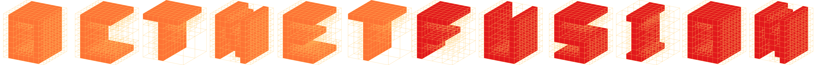

<p align="center"></p>

OctNetFusion is a data-driven method for volumetric depth fusion and depth completion. We extend [OctNet](https://github.com/griegler/octnet) to enable high-resolution 3D outputs of convolutional networks.

This is the code for the paper:

**[OctNetFusion: Learning Depth Fusion from Data](https://arxiv.org/abs/1704.01047)**
<br>
[Gernot Riegler](https://griegler.github.io/), [Ali Osman Ulusoy](https://avg.is.tuebingen.mpg.de/person/oulusoy), [Horst Bischof](https://www.tugraz.at/institute/icg/research/team-bischof/people/team-about/horst-bischof/) and [Andreas Geiger](https://avg.is.tuebingen.mpg.de/person/ageiger)
<br>
[3DV 2017](http://irc.cs.sdu.edu.cn/3dv/)

> In this paper, we present a learning based approach to depth fusion, i.e., dense 3D reconstruction from multiple depth images. The most common approach to depth fusion is based on averaging truncated signed distance functions, which was originally proposed by Curless and Levoy in 1996. While this method is simple and provides great results, it is not able to reconstruct (partially) occluded surfaces and requires a large number frames to filter out sensor noise and outliers. Motivated by the availability of large 3D model repositories and recent advances in deep learning, we present a novel 3D CNN architecture that learns to predict an implicit surface representation from the input depth maps. Our learning based method significantly outperforms the traditional volumetric fusion approach in terms of noise reduction and outlier suppression. By learning the structure of real world 3D objects and scenes, our approach is further able to reconstruct occluded regions and to fill in gaps in the reconstruction. We demonstrate that our learning based approach outperforms both vanilla TSDF fusion as well as TV-L1 fusion on the task of volumetric fusion. Further, we demonstrate state-of-the-art 3D shape completion results.

If you find this code useful for your research, please cite

```
@inproceedings{Riegler2017OctNetFusion,
  title={OctNetFusion: Learning Depth Fusion from Data},
  author={Riegler, Gernot and Ulusoy, Ali Osman and Bischof, Horst and Geiger, Andreas},
  booktitle={Proceedings of the International Conference on 3D Vision},
  year={2017}
}
```

## Code Overview
- `src` - Contains Python/Lua code that is shared for all experiments.
- `src/modelnet` - Code to create data for the ModelNet experiments and train/test networks.

To run the ModelNet experiments you have to create the data first by running `create_data.py`.
Make sure the Python libraries are in your `$PYTHONPATH` and the path to the ModelNet40 dataset is set.  
You can change the setting by changing the number of input views and the input noise.

An exemplar training/testing script with the predefined setting is provided: `train_s1n02_tsdfhist.lua`.

## Requirements
To create the data and train/test the OctNetFusion code you need the following packages in your `$PYTHONPATH`
- [oc](https://github.com/griegler/octnet): OctNet code/Python wrapper
- [pyrender](https://github.com/griegler/pyrender): Depthmaps from triangle meshes
- [pyfusion](https://github.com/griegler/pyfusion): Volumetric depth map fusion
